# Mermaid Design Skill

This skill provides capabilities for generating, editing, and working with Mermaid diagrams to visualize systems, processes, and technical concepts across all types of projects regardless of technology stack or domain.

## When to Use This Skill

Use this skill when you need to:
- Document system architecture with visual diagrams
- Create user flow charts for any application type
- Visualize API interactions and data flows
- Generate process diagrams for business logic
- Create documentation diagrams for team communication
- Represent database schemas or data models visually
- Model software architecture patterns
- Illustrate deployment configurations
- Diagram microservice interactions
- Map out CI/CD pipelines
- Document security workflows

## Diagram Types Supported

### Flowcharts
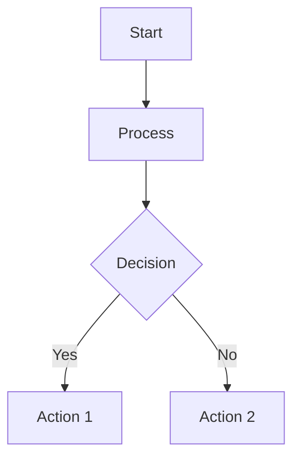

### Sequence Diagrams
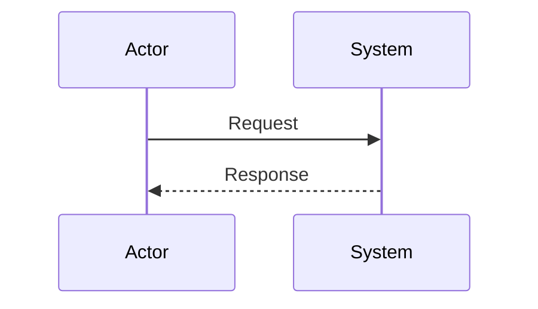

### Class Diagrams
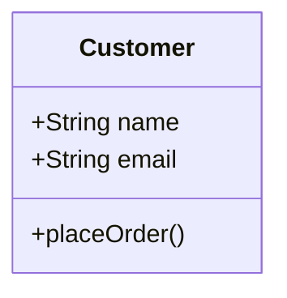

### State Diagrams
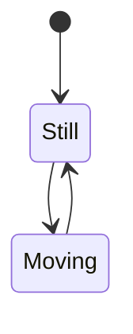

### Gantt Charts
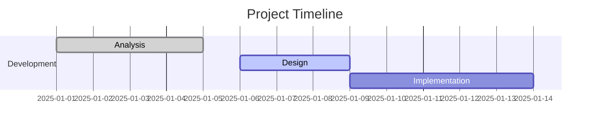

## Universal Templates for Various Project Types

### 1. Software Architecture
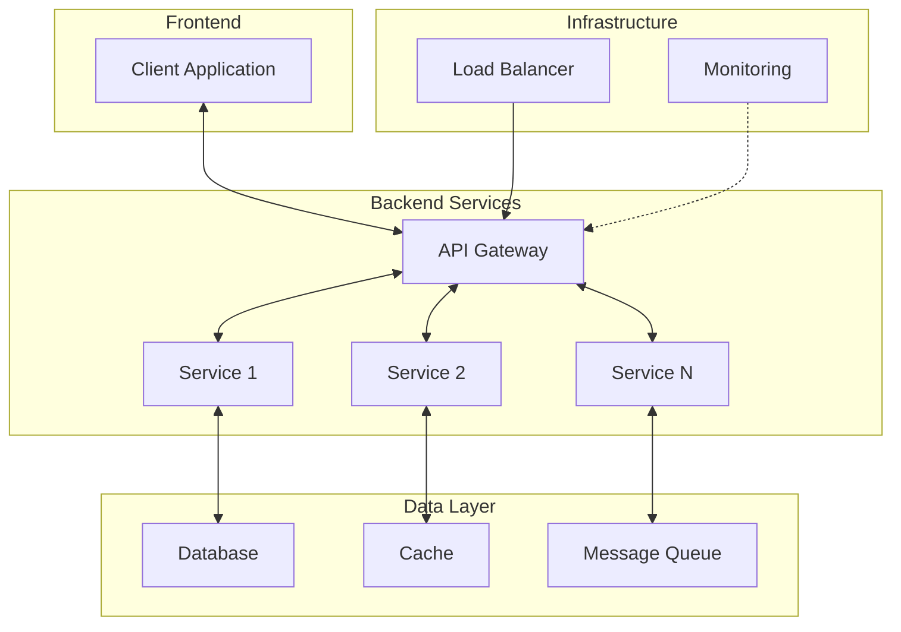

### 2. Microservices Architecture
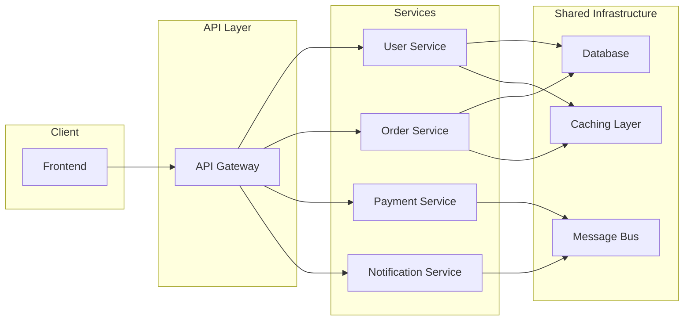

### 3. Deployment Architecture
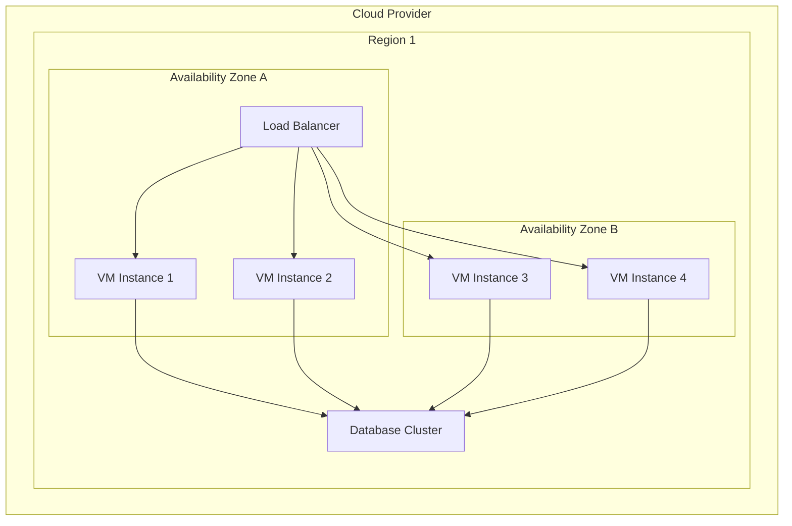

### 4. Development Process Flow
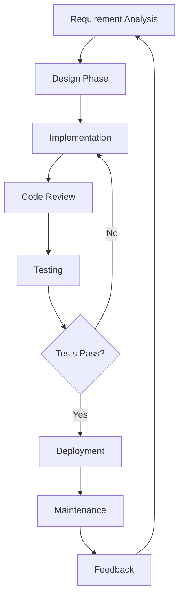

### 5. CI/CD Pipeline
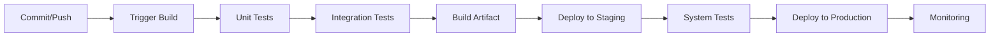

### 6. Database Relationships
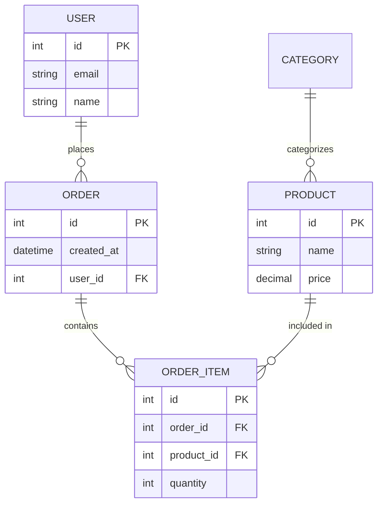

## Pre-configured Templates by Category

### Web Applications
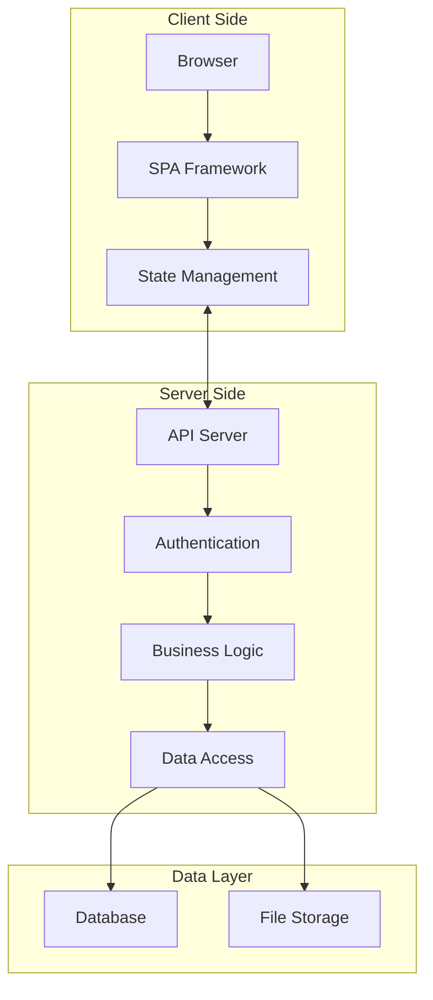

### Mobile Applications
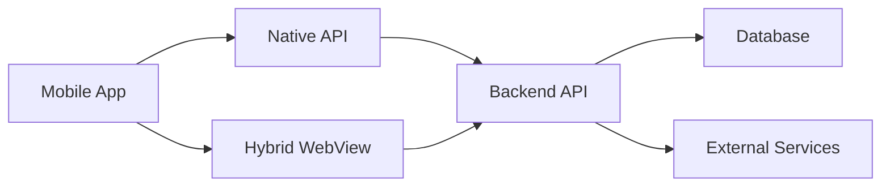

### Cloud Architecture
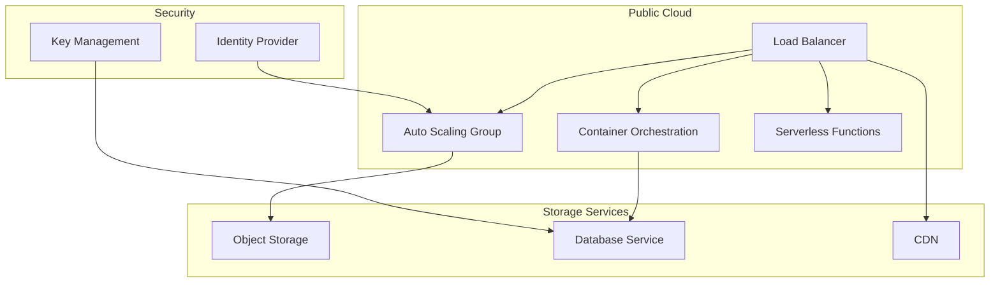

## Rendering Mermaid Diagrams

Mermaid diagrams can be rendered using various tools:

1. **Mermaid Live Editor**: Paste the diagram code into https://mermaid.live
2. **GitHub**: Mermaid diagrams render directly in markdown files
3. **Documentation Tools**: Many tools like Notion, Obsidian, and GitLab support Mermaid
4. **IDE Extensions**: VS Code extensions like "Mermaid Preview" can render diagrams
5. **Command Line Tools**: Tools like `mmdc` (Mermaid CLI) can generate images from diagram code

## Generating Diagrams Programmatically

The skill includes tools for:
- Creating parameterized templates for consistent diagrams
- Generating diagrams from data configuration files
- Maintaining diagram consistency across documentation

## Customization for Specific Projects

While this skill provides universal templates, you can easily adapt diagrams for specific technologies:

1. **Node.js Applications**: Replace generic services with Express, NestJS, etc.
2. **Python Applications**: Adapt for Django, Flask, FastAPI frameworks
3. **Java Applications**: Customize for Spring Boot, Jakarta EE
4. **Cloud Platforms**: Modify for AWS, Azure, GCP specific services
5. **DevOps**: Adapt for Docker, Kubernetes, Terraform specifics

## Integration with Documentation Workflows

Include generated diagrams in:
- System architecture documents
- Developer onboarding materials
- API documentation
- Troubleshooting guides
- Technical proposals
- Training materials
- Stakeholder presentations