# Industry Standard Diagram Patterns

## Software Architecture Patterns

### Layered Architecture
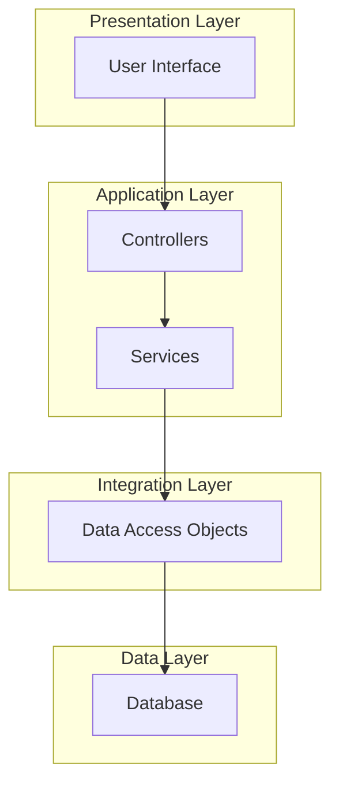

### Hexagonal Architecture (Ports and Adapters)
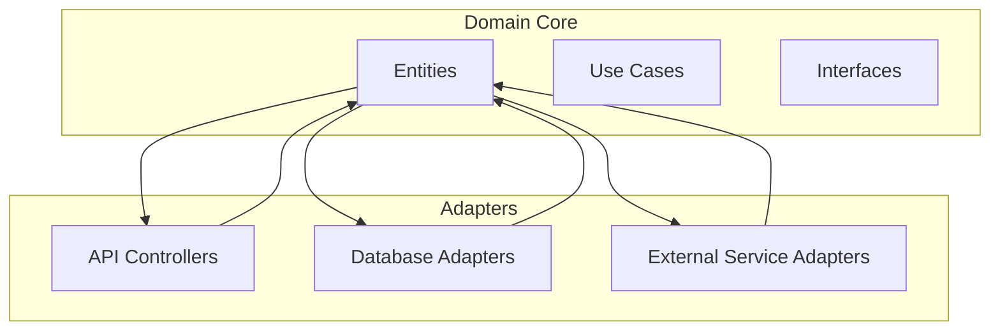

### Clean Architecture
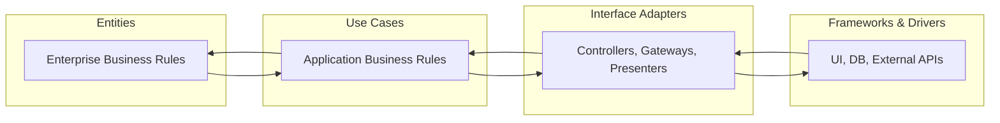

## System Design Patterns

### Event-Driven Architecture
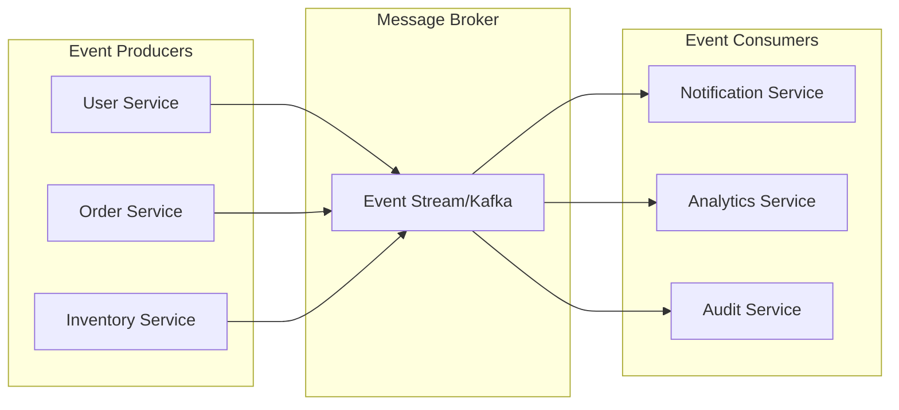

### Microservices Architecture
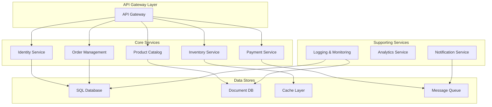

## DevOps and Infrastructure

### CI/CD Pipeline
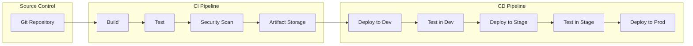

### Infrastructure Architecture
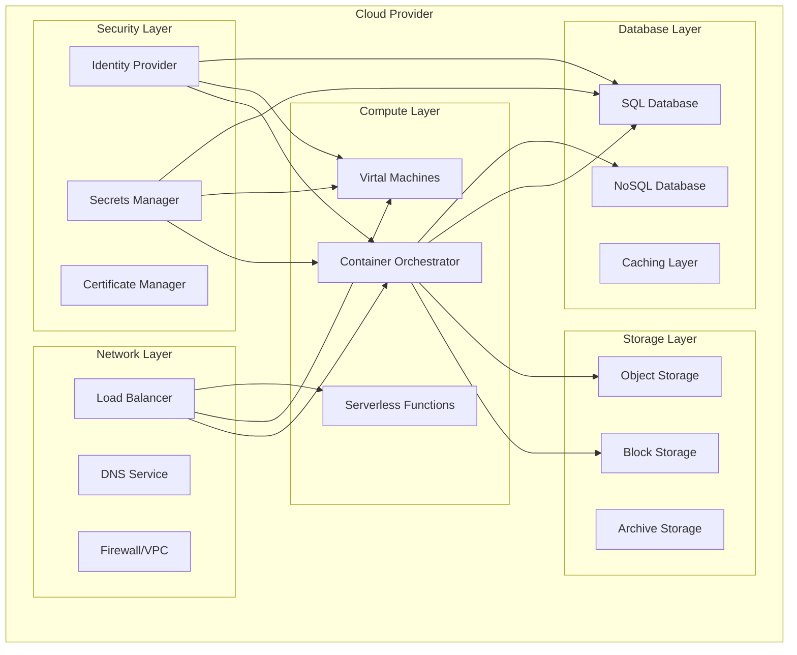

## Database Design Patterns

### Relational Schema
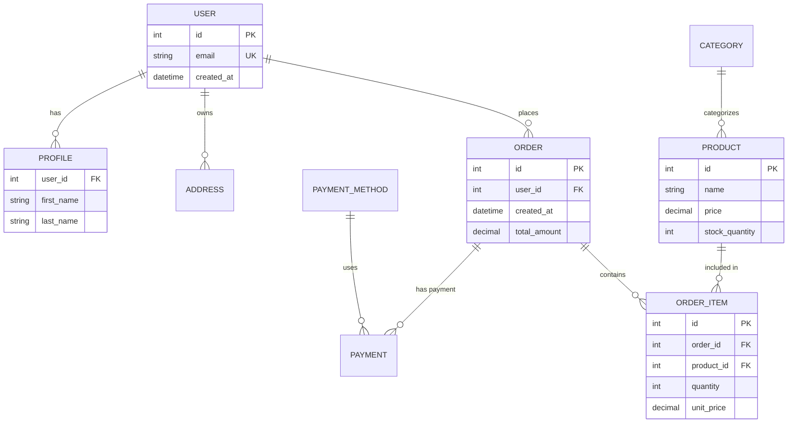

### Document Schema
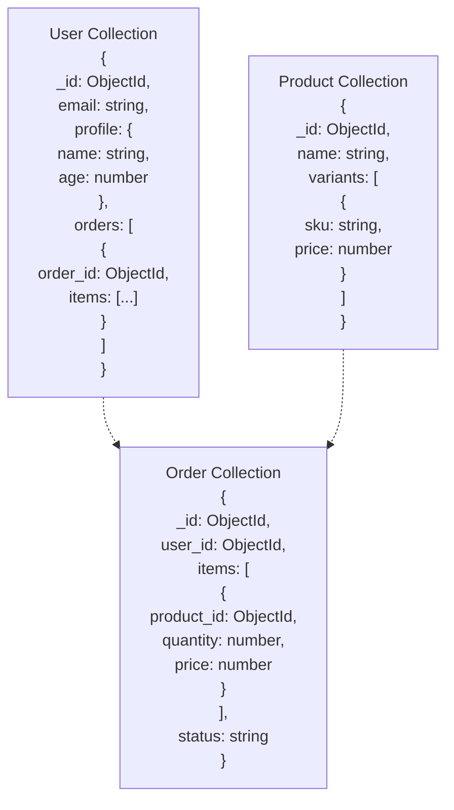

## Security Architecture

### Zero Trust Architecture
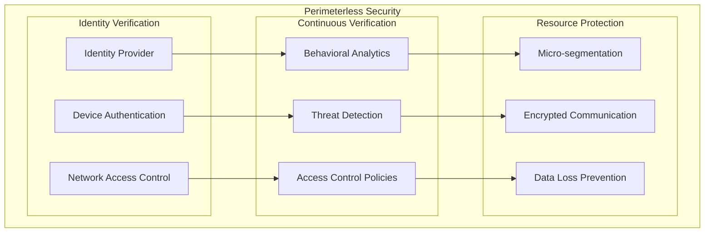

## API Design Patterns

### RESTful API Architecture
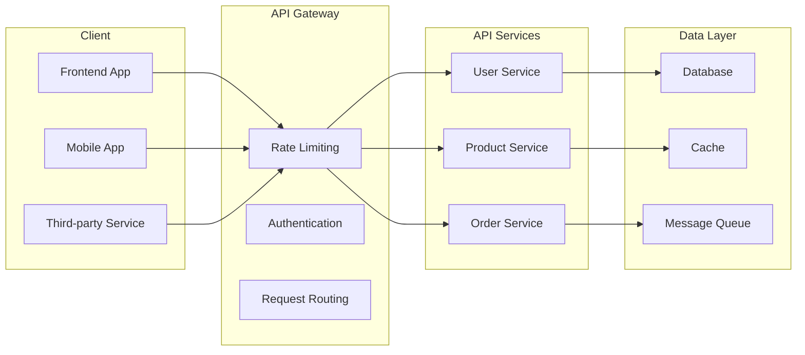

### GraphQL Architecture
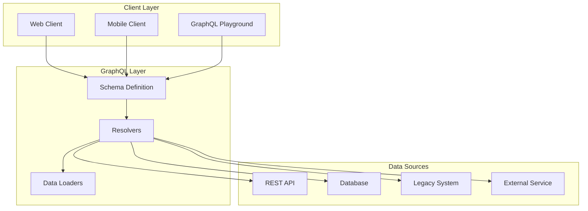

## Business Process Patterns

### Order Processing Flow
```mermaid
graph TD
    A[Order Received] --> B{Validate Order}
    B -->|Invalid| C[Reject Order]
    B -->|Valid| D[Process Payment]
    D --> E{Payment Approved?}
    E -->|No| F[Payment Failed]
    E -->|Yes| G[Check Inventory]
    G --> H{Sufficient Stock?}
    H -->|No| I[Out of Stock]
    H -->|Yes| J[Fulfill Order]
    J --> K[Ship Product]
    K --> L[Notify Customer]
    L --> M[Update Records]

    style A fill:#e1f5fe
    style M fill:#e8f5e8
    style F fill:#ffebee
    style C fill:#ffebee