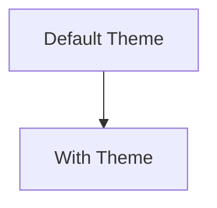
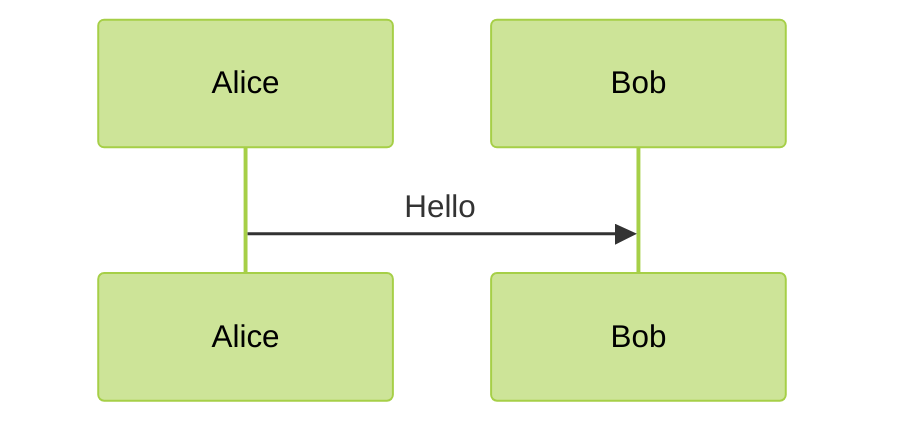

# Mermaid Syntax Reference

## Flowchart Syntax

### Node Shapes
```
A[Rectangular box]
B(Round rectangle)
C{Diamond - Decision}
D[[Double circle]]
E[(Cylinder)]
F{{Hexagon}}
G(/Parallelogram/)
H{{Rhombus}}
I[Double octagon]
```

### Connections
```
A --> B  // Solid arrow
A --- B  // Solid line without arrow
A -.-> B // Dotted arrow
A ==> B  // Thick arrow
A <--> B // Bidirectional
A <-->|Text| B // With text on bidirectional
```

### Subgraphs
```
subgraph Subgraph Title
  A --> B
  B --> C
end
```

## Sequence Diagram Syntax

### Participants
```
participant A as "Participant Name"
actor A as "Actor"
boundary B
control C
entity E
database D
collections Coll
```

### Messages
```
A ->> B: Synchronous message
A -->> B: Async message
A ->>+ B: Message with activation
A --)+ B: Async with activation
A -) B: Return message
```

### Groups
```
alt Choice 1
  A ->> B: Option 1
else Choice 2
  A ->> B: Option 2
end

opt Optional
  A ->> B: Optional message
end

loop Loop text
  A ->> B: Message in loop
end

par Parallel
  A ->> B: Message in parallel
and
  C ->> D: Another parallel message
end
```

## Class Diagram Syntax

### Classes and Relations
```
classDiagram
Class01 <|-- Class02 : Inheritance
Class03 *-- Class04 : Composition
Class05 o-- Class06 : Aggregation
Class07 .. Class08 : Dependency
Class09 -- Class10 : Association
Class11 <|.. Class12 : Realization
Class13 .. Class14 : Dotted association
```

### Class Definition
```
class Square~Shape~{
  +int id
  +List~int~ position
  +move()
  +draw()
  -- String privateField
  #protectedMethod()
  ~packagePrivateMethod()
}
```

## State Diagram Syntax

### Basic States
```
stateDiagram-v2
  [*] --> Still
  Still --> [*]
  Still --> Moving
  Moving --> Still
  Moving --> Crash
  Crash --> [*]
```

### Composite States
```
stateDiagram-v2
  [*] --> First
  state First {
    [*] --> second
    second --> [*]
  }
  First --> Second
  Second --> Third
  Third --> [*]
```

## Activity Diagram Syntax

### Basic Activities
```
stateDiagram-v2
  [*] --> Active
  Active --> Inactive
  Inactive --> [*]
```

### Swimlanes
```
stateDiagram-v2
  state fork_state <<fork>>
  [*] --> fork_state
  fork_state --> State2
  fork_state --> State3

  state join_state <<join>>
  State2 --> join_state
  State3 --> join_state
  join_state --> State4
  State4 --> [*]
```

## ER Diagram Syntax

### Entities and Relations
```
erDiagram
    CUSTOMER ||--o{ ORDER : places
    ORDER ||--|{ LINE-ITEM : contains
    CUSTOMER }|..|{ DELIVERY-ADDRESS : uses
```

### Entity Definition
```
erDiagram
    CUSTOMER {
        string name
        string custNumber PK
        string cellPhone
    }
    ORDER {
        string orderNumber PK
        string deliveryDate
        int delivered FK
    }
```

## Gantt Chart Syntax

### Basic Gantt
```
gantt
    title Sample Gantt Chart
    dateFormat YYYY-MM-DD
    section Section 1
    Task A : taskA, 2025-01-01, 30d
    Task B : taskB, 2025-01-15, 20d
    section Section 2
    Task C : taskC, after taskA, 30d
    Task D : taskD, 2025-02-01, 20d
```

### Milestones and Dependencies
```
gantt
    title Project Schedule
    dateFormat YYYY-MM-DD
    section Development
    Analysis : done, des1, 2025-01-01, 2025-01-10
    Design : active, des2, 2025-01-05, 2025-01-20
    Implementation : imp1, 2025-01-15, 2025-02-15
    Testing : test1, 2025-02-10, 2025-03-01
```

## Git Graph Syntax

### Basic Git History
```
gitGraph
  commit id: "Initial commit"
  commit id: "Feature A"
  branch develop
  checkout develop
  commit id: "Feature B"
  commit id: "More of B"
  checkout main
  merge develop id: "Merge B into main"
  commit id: "Bug fix"
```

## Pie Chart Syntax

### Basic Pie Chart
```
pie title Pets Distribution
    "Dogs" : 386
    "Cats" : 85
    "Rats" : 15
```

## Mindmap Syntax

### Hierarchical Structure
```
mindmap
  root((mindmap))
    Origins
      Long history
        Classics
      Popularisation
        British popular psychology author Tony Buzan
    Research
      On effectiveness<br/>and features
      On Automatic<br/>creation
        Uses
          Creative techniques
          Strategic planning
          Argument mapping
    Tools
      Pen and paper
      Mermaid
```

## C4 Diagram Syntax

### Context Diagram
```
C4Context
  title System Context diagram for Internet Banking System

  Person(customer, "Banking Customer", "A customer of the bank, with personal bank accounts")
  System(banking_system, "Internet Banking System", "Allows customers to check account balances, view statements, and make payments")

  Rel(customer, banking_system, "Uses")
```

### Container Diagram
```
C4Container
  title Container diagram for Internet Banking System

  System_Boundary(banking_system, "Internet Banking System") {
    Container(web_app, "Web Application", "Java, Spring MVC", "Delivers the static assets and serves the Internet banking functional API")
    Container(api, "API Application", "Java, Docker", "Provides Internet banking functionality via API")
    Container(db, "Database", "PostgreSQL", "Stores user information, account information, and transaction history")
  }

  Rel(customer, web_app, "Uses", "HTTPS")
  Rel(customer, api, "Uses", "HTTPS")
  Rel(web_app, api, "Communicates with", "JSON/HTTPS")
  Rel(api, db, "Reads/writes", "JDBC")
```

## Configuration Options

### Theme


### Other Configuration


## Styling

### CSS-like Styling
```
classDef className fill:#f9f,stroke:#333,stroke-width:2px
class nodeID className
```

### Multiple Classes
```
classDef orange fill:#f96
classDef blackAndWhite fill:#ddd,stroke:#000,stroke-width:2px
class A orange
class B,C,D blackAndWhite
```

### Themes
- default
- forest
- dark
- neutral
- material-dark